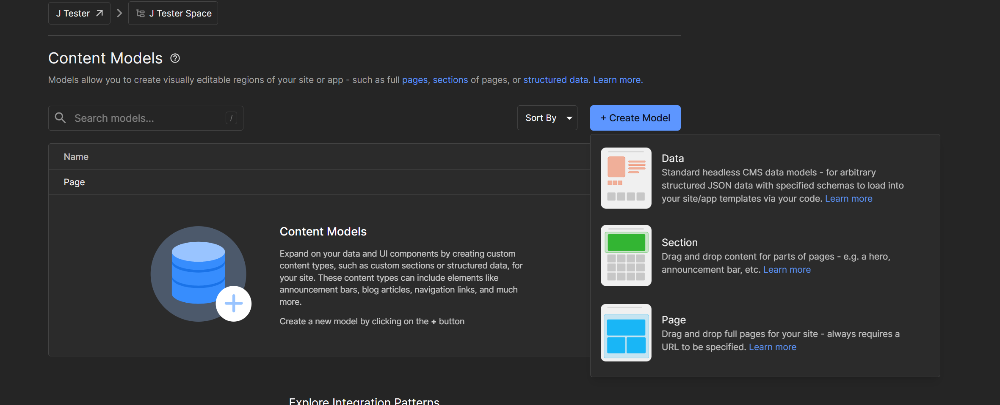
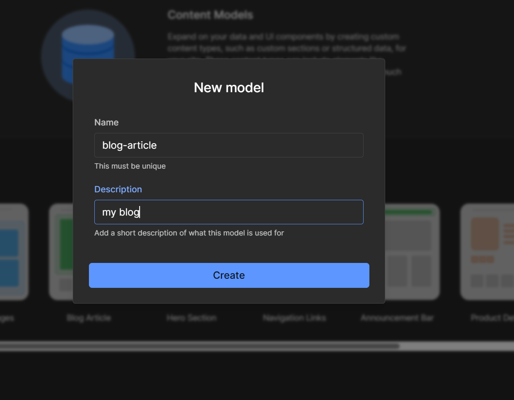
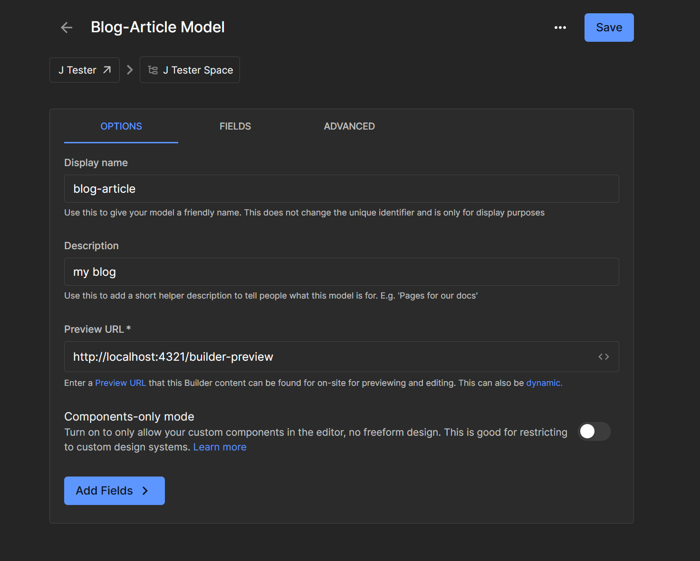
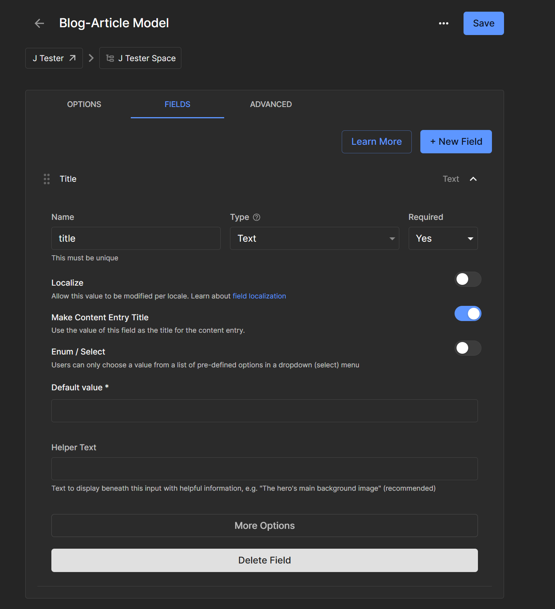
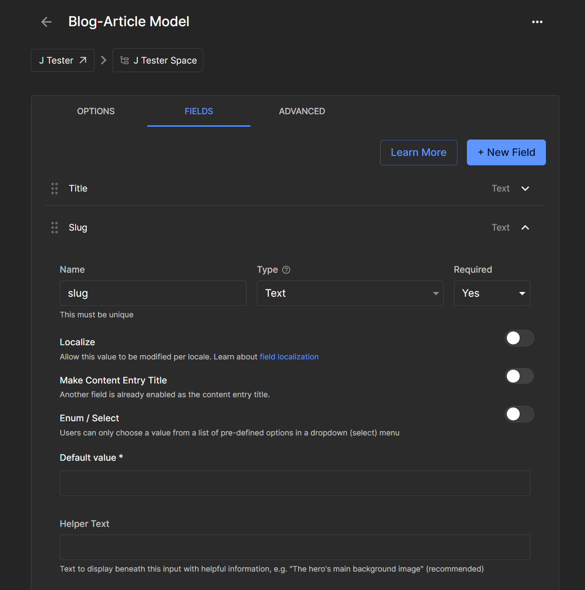
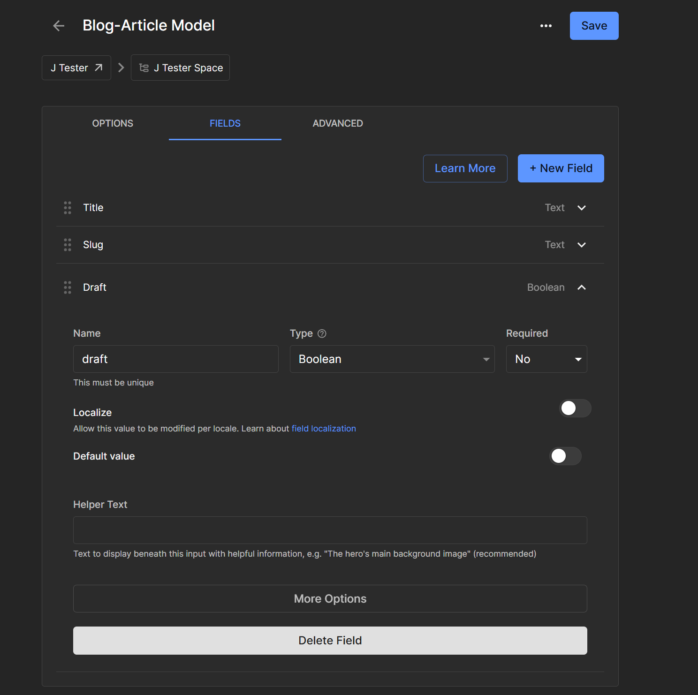
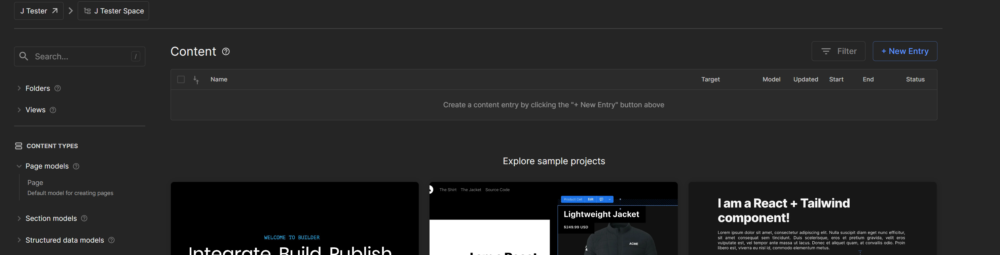
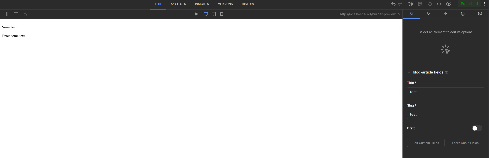

# Astro Starter Kit: Minimal

## Setup

Create a new builder.io project. 

Click on ["Models"](https://builder.io/models) and then create a new "Section".




Name it "blog-article", with any description.




Connect it up to your builder preview url (the astro site, typically this would be running on `http://localhost:4321/builder-preview`). Then click on save.

.

Add in the following fields "title", "slug" and "draft". 







After you added these fields, click "Save".

Then click on ["Content"](https://builder.io/content) and create some new blog article content, making sure to publish them when done.



Fill out some blog content (Note: I don't even include my custom QWIK component yet the issue will still happen!)



Again remember to click on "Publish"!!!.

Lastly if you head over to your [settings](https://builder.io/account/space) you can view your public API key which should be stored in your `.env`.

Set up `.env`

```bash
BUILDER_API_PUBLIC_KEY=XXXX-XXXX-XXXX
BUILDER_BLOGPOST_MODEL='blog-article'
```


## 🧞 Commands

All commands are run from the root of the project, from a terminal:

| Command                   | Action                                           |
| :------------------------ | :----------------------------------------------- |
| `npm install`             | Installs dependencies                            |
| `npm run dev`             | Starts local dev server at `localhost:4321`      |
| `npm run build`           | Build your production site to `./dist/`          |
| `npm run preview`         | Preview your build locally, before deploying     |
| `npm run astro ...`       | Run CLI commands like `astro add`, `astro check` |
| `npm run astro -- --help` | Get help using the Astro CLI                     |

## 👀 Want to learn more?

Feel free to check [our documentation](https://docs.astro.build) or jump into our [Discord server](https://astro.build/chat).
